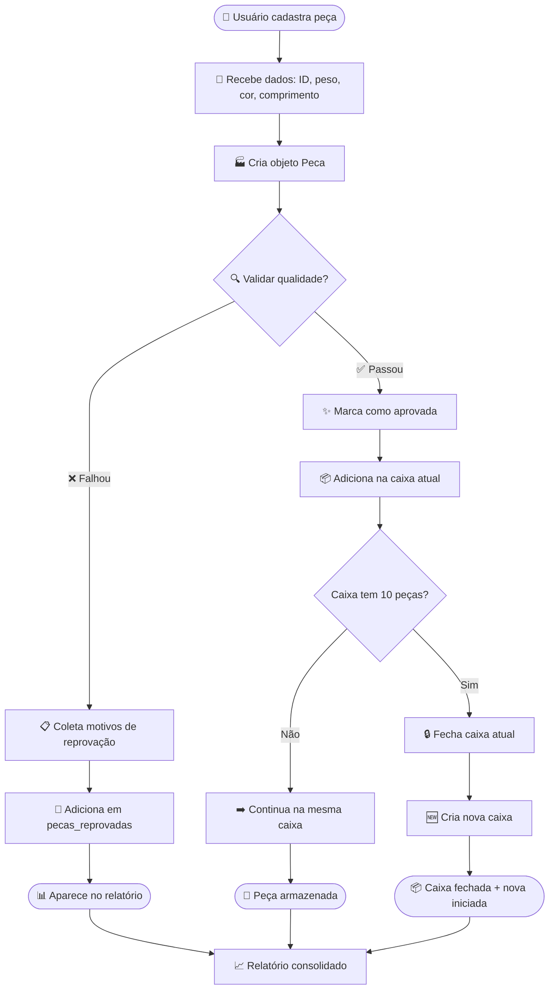
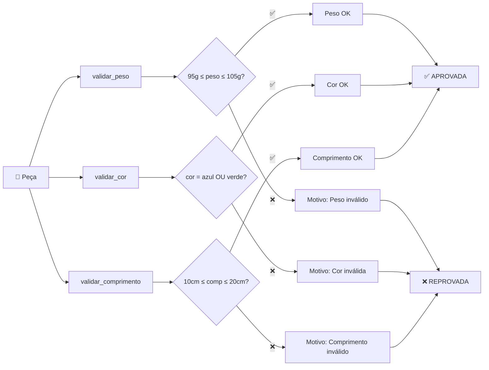
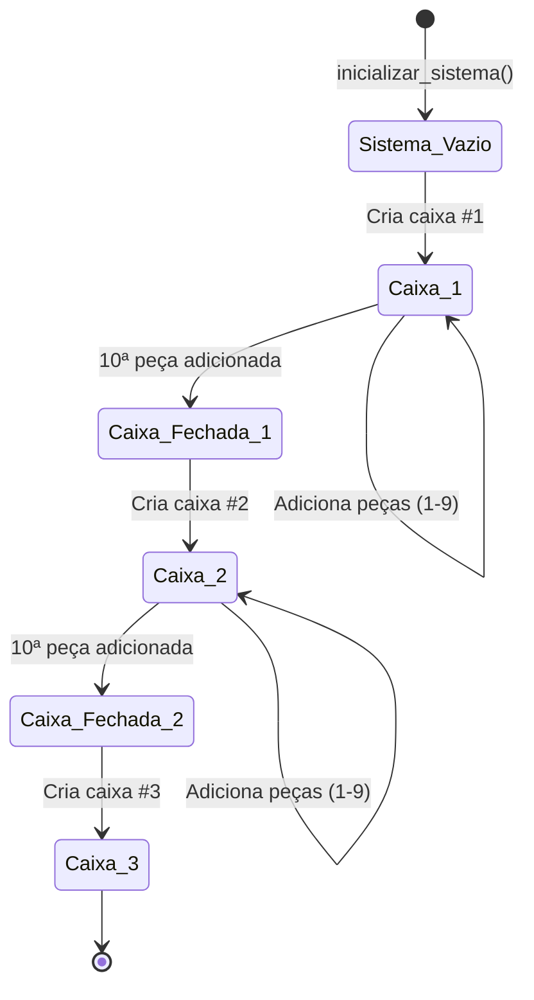
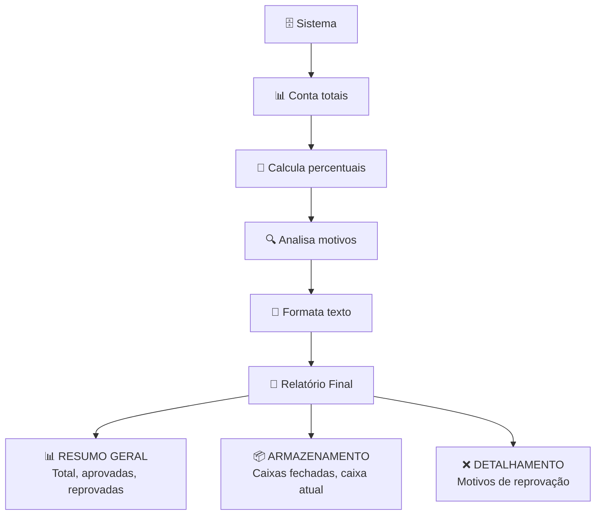
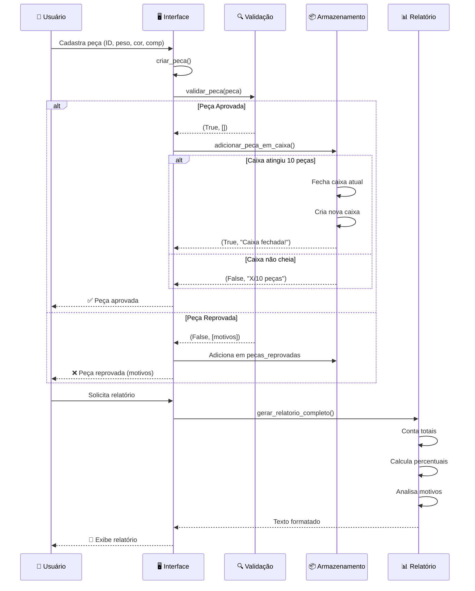
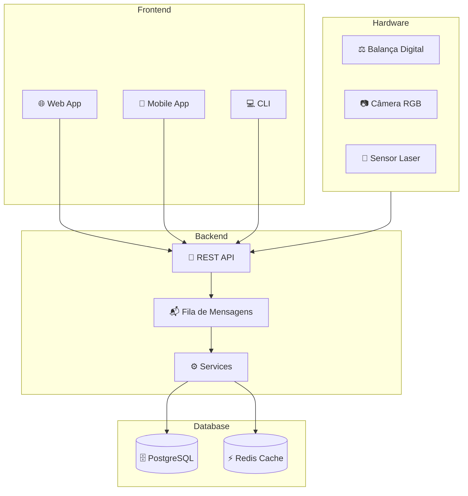
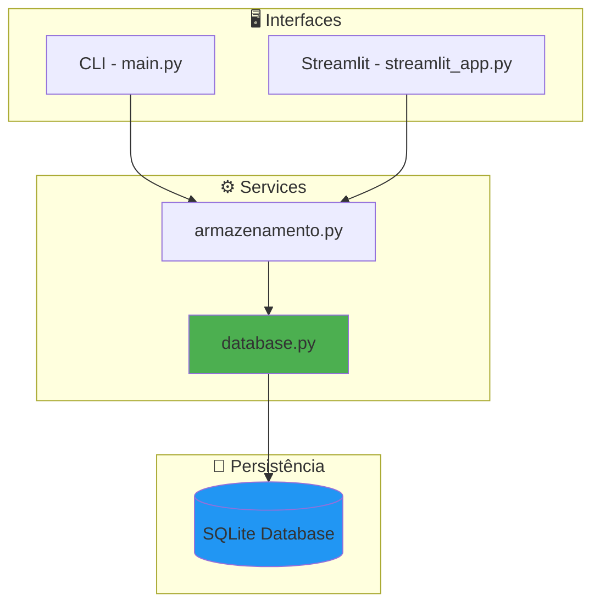

# 🏗️ Arquitetura do Sistema de Gestão de Peças Industriais

> Escrito por **Gabriel Falcão** - Uma jornada pelo código que criei

---

## 📖 Prefácio

Olá! Sou Gabriel Falcão e este é o sistema que desenvolvi como projeto acadêmico. Decidi escrever este documento para explicar não apenas *o que* o código faz, mas *por que* tomei cada decisão arquitetural. Se você está lendo isso, provavelmente quer entender como tudo funciona por baixo dos panos. Vamos nessa!

## 🎯 O Problema Real

Antes de falar de código, deixa eu te contar o problema que resolvi:

Imagine uma fábrica que produz **centenas de peças por dia**. Cada peça precisa passar por controle de qualidade:
- ✅ Peso entre 95g e 105g?
- ✅ Cor azul ou verde?
- ✅ Comprimento entre 10cm e 20cm?

Se **TODOS** os critérios passarem → peça aprovada → vai para uma caixa
Se **QUALQUER** critério falhar → peça reprovada → registra o motivo

Quando uma caixa atinge 10 peças, ela fecha automaticamente e uma nova começa.

Simples, né? Mas tem muita lógica por trás!

---

## 🏛️ Visão Geral da Arquitetura

Eu estruturei o projeto seguindo princípios de **Clean Architecture**. Por quê? Porque queria que o código fosse:
- 📖 **Fácil de ler** - Cada arquivo tem uma responsabilidade
- 🧪 **Fácil de testar** - Separei lógica de interface
- 🔧 **Fácil de manter** - Se precisar mudar algo, sei onde mexer
- 📈 **Fácil de escalar** - Dá pra adicionar features sem quebrar nada

```
┌─────────────────────────────────────────────────────────┐
│                    INTERFACES                           │
│  ┌──────────────┐              ┌──────────────┐        │
│  │   main.py    │              │streamlit_app │        │
│  │     CLI      │              │      Web     │        │
│  └──────┬───────┘              └──────┬───────┘        │
└─────────┼──────────────────────────────┼───────────────┘
          │                              │
          ▼                              ▼
┌─────────────────────────────────────────────────────────┐
│                    SERVICES                             │
│  ┌──────────────┐  ┌──────────────┐  ┌──────────────┐ │
│  │  validacao   │  │armazenamento │  │  relatorio   │ │
│  │ (regras de   │  │  (gestão de  │  │ (estatísti-  │ │
│  │  qualidade)  │  │    caixas)   │  │    cas)      │ │
│  └──────┬───────┘  └──────┬───────┘  └──────┬───────┘ │
└─────────┼──────────────────┼──────────────────┼─────────┘
          │                  │                  │
          ▼                  ▼                  ▼
┌─────────────────────────────────────────────────────────┐
│                     MODELS                              │
│         ┌──────────────┐      ┌──────────────┐         │
│         │   Peca       │      │    Caixa     │         │
│         │ (TypedDict)  │      │  (TypedDict) │         │
│         └──────────────┘      └──────────────┘         │
└─────────────────────────────────────────────────────────┘
```

### Por que 3 Camadas?

**Models (Modelos)** - Os "tijolos" do sistema
- Define *o que* é uma Peça e uma Caixa
- Sem lógica, só estrutura de dados
- TypedDict para type safety

**Services (Serviços)** - O "cérebro" do sistema
- Define *como* validar, armazenar e gerar relatórios
- Toda a lógica de negócio está aqui
- Funções puras e testáveis

**Interfaces** - A "cara" do sistema
- Define *como* o usuário interage
- CLI para terminal, Streamlit para web
- Usa os services, nunca mexe direto nos models

---

## 🔄 Fluxo Completo do Sistema

Vou te mostrar o que acontece desde o momento que você cadastra uma peça até ela virar estatística:



---

## 🧩 Anatomia de Cada Componente

### 1. Models - Os Dados

#### Peca (models/peca.py)

```python
class Peca(TypedDict):
    id: str                      # Identificador único
    peso: float                  # Em gramas
    cor: str                     # Nome da cor
    comprimento: float           # Em centímetros
    aprovada: bool               # Status de qualidade
    motivos_reprovacao: List[str]  # Lista de problemas
```

**Por que TypedDict?**
- ✅ Type hints nativos do Python
- ✅ Não precisa de classes pesadas
- ✅ Fácil de serializar (JSON, banco de dados)
- ✅ IDE autocomplete funciona perfeitamente

**Factory Pattern:**
```python
def criar_peca(id_peca, peso, cor, comprimento, aprovada=False):
    return Peca(...)
```
Centralizei a criação em uma função. Se um dia eu quiser adicionar validação ou log, mudo só aqui!

#### Caixa (models/caixa.py)

```python
class Caixa(TypedDict):
    id: int                    # Número sequencial
    pecas: List[Peca]          # Peças dentro da caixa
    fechada: bool              # Está cheia?

CAPACIDADE_MAXIMA_CAIXA = 10   # Constante global
```

Simples e direto. Uma caixa é só um container com ID.

---

### 2. Services - A Lógica

#### Validação (services/validacao.py)

Este é o coração do controle de qualidade. Cada critério tem sua própria função:



**Princípio Single Responsibility:**

Cada função faz **UMA** coisa:

```python
def validar_peso(peso: float) -> Tuple[bool, str]:
    """Só valida peso, nada mais!"""
    if PESO_MINIMO <= peso <= PESO_MAXIMO:
        return True, ""
    return False, f"Peso fora do intervalo..."

def validar_cor(cor: str) -> Tuple[bool, str]:
    """Só valida cor, nada mais!"""
    cor_normalizada = cor.lower().strip()  # Case-insensitive
    if cor_normalizada in CORES_ACEITAS:
        return True, ""
    return False, f"Cor inadequada..."
```

**Por que separar?**
- 🧪 Fácil de testar cada critério
- 🔧 Fácil de mudar regras
- 📖 Código auto-documentado
- ➕ Fácil de adicionar novos critérios

#### Armazenamento (services/armazenamento.py)

Aqui é onde a mágica das caixas acontece:



**Estado do Sistema:**

```python
SistemaArmazenamento = {
    'pecas_aprovadas': [],        # Todas que passaram
    'pecas_reprovadas': [],       # Todas que falharam
    'caixas_fechadas': [],        # Caixas completas (10 peças)
    'caixa_atual': Caixa(id=1),   # Caixa sendo preenchida
    'contador_caixas': 1          # Próximo ID
}
```

**Lógica de Fechamento:**

```python
def adicionar_peca_em_caixa(peca, sistema):
    # Adiciona na caixa
    sistema['caixa_atual']['pecas'].append(peca)

    # Conta quantas peças tem
    total = len(sistema['caixa_atual']['pecas'])

    # Atingiu 10?
    if total >= CAPACIDADE_MAXIMA_CAIXA:
        # 1. Marca como fechada
        sistema['caixa_atual']['fechada'] = True

        # 2. Move para lista de fechadas
        sistema['caixas_fechadas'].append(sistema['caixa_atual'])

        # 3. Cria nova caixa
        sistema['contador_caixas'] += 1
        sistema['caixa_atual'] = criar_caixa(sistema['contador_caixas'])

        return True, "Caixa fechada!"

    return False, f"Caixa atual: {total}/10"
```

Isso é **automático**. O usuário só adiciona peças, o sistema cuida do resto!

#### Relatório (services/relatorio.py)

Aqui eu transformo dados brutos em informação útil:



**Análise de Motivos:**

```python
def analisar_motivos_reprovacao(pecas_reprovadas):
    contadores = {'peso': 0, 'cor': 0, 'comprimento': 0}

    for peca in pecas_reprovadas:
        for motivo in peca['motivos_reprovacao']:
            # Case-insensitive search
            if 'peso' in motivo.lower():
                contadores['peso'] += 1
            elif 'cor' in motivo.lower():
                contadores['cor'] += 1
            elif 'comprimento' in motivo.lower():
                contadores['comprimento'] += 1

    return contadores
```

Uma peça pode ter **múltiplos** motivos. Conto cada um separadamente.

---

## 🎨 Decisões de Design

### 1. Por que TypedDict em vez de Classes?

```python
# Opção 1: Classe tradicional
class Peca:
    def __init__(self, id, peso, cor, comprimento):
        self.id = id
        self.peso = peso
        # ...

# Opção 2: TypedDict (escolhi essa!)
Peca = TypedDict('Peca', {
    'id': str,
    'peso': float,
    # ...
})
```

**Vantagens do TypedDict:**
- ✅ Dicionários são nativos do Python
- ✅ Fácil de converter para JSON
- ✅ Type hints sem overhead de classes
- ✅ Mais pythônico para estruturas simples

### 2. Por que Constantes no Topo?

```python
# services/validacao.py
PESO_MINIMO = 95.0
PESO_MAXIMO = 105.0
CORES_ACEITAS = ['azul', 'verde']
COMPRIMENTO_MINIMO = 10.0
COMPRIMENTO_MAXIMO = 20.0
```

**Benefícios:**
- 🔧 Mudar critérios? Só mudo aqui!
- 📖 Auto-documentação
- 🧪 Fácil de mockar em testes
- 🚀 Possível fazer config externa depois

### 3. Por que Funções em vez de Métodos?

Eu poderia ter feito tudo orientado a objetos, mas escolhi **programação funcional**:

```python
# Funcional (escolhi isso)
def validar_peca(peca: Peca) -> Tuple[bool, List[str]]:
    # Função pura: mesmo input = mesmo output
    # Sem efeitos colaterais
    pass

# vs

# OOP
class ValidadorPeca:
    def validar(self, peca):
        # Pode ter estado interno
        # Mais verboso
        pass
```

**Por quê?**
- ✅ Funções puras são **fáceis de testar**
- ✅ Sem estado oculto (explicit is better than implicit)
- ✅ Menos código boilerplate
- ✅ Composição > Herança

---

## 🔄 Exemplos Práticos

### Exemplo 1: Peça Aprovada

```python
# 1. Usuário cadastra
peca = criar_peca(
    id_peca="P001",
    peso=100.0,        # ✅ Entre 95-105
    cor="azul",        # ✅ Cor aceita
    comprimento=15.0   # ✅ Entre 10-20
)

# 2. Sistema valida
aprovada, motivos = validar_peca(peca)
# aprovada = True
# motivos = []

# 3. Atualiza peça
peca['aprovada'] = True
peca['motivos_reprovacao'] = []

# 4. Armazena
caixa_fechada, msg = adicionar_peca_em_caixa(peca, sistema)
# caixa_fechada = False
# msg = "Peça P001 adicionada à Caixa #1 (1/10 peças)"
```

### Exemplo 2: Peça Reprovada

```python
# 1. Usuário cadastra
peca = criar_peca(
    id_peca="P002",
    peso=120.0,         # ❌ Acima de 105
    cor="vermelho",     # ❌ Cor não aceita
    comprimento=25.0    # ❌ Acima de 20
)

# 2. Sistema valida
aprovada, motivos = validar_peca(peca)
# aprovada = False
# motivos = [
#     "Peso fora do intervalo (95.0-105.0g): 120.0g",
#     "Cor inadequada (esperado: azul ou verde): vermelho",
#     "Comprimento fora do intervalo (10.0-20.0cm): 25.0cm"
# ]

# 3. Atualiza peça
peca['aprovada'] = False
peca['motivos_reprovacao'] = motivos

# 4. Adiciona em reprovadas
sistema['pecas_reprovadas'].append(peca)
```

### Exemplo 3: Fechamento de Caixa

```python
# Sistema com 9 peças na caixa atual
sistema['caixa_atual']['pecas'] = [peça1, peça2, ..., peça9]

# 10ª peça chega
peca10 = criar_peca("P010", 100.0, "verde", 15.0, aprovada=True)

# Adiciona
caixa_fechada, msg = adicionar_peca_em_caixa(peca10, sistema)

# Resultado:
# caixa_fechada = True
# msg = "Caixa #1 FECHADA (10 peças). Nova Caixa #2 iniciada"
#
# sistema['caixas_fechadas'] = [caixa1_com_10_pecas]
# sistema['caixa_atual'] = caixa2_vazia
# sistema['contador_caixas'] = 2
```

---

## 📊 Diagrama de Sequência Completo



---

## 🧪 Como os Testes se Encaixam

Eu escrevi **208 testes** com **100% de cobertura**. Mas não foi só por escrever. Cada teste valida uma regra de negócio:

### Estrutura de Testes

```
tests/
├── unit/                      # Testa funções isoladas
│   ├── test_validacao.py     # Cada critério
│   ├── test_armazenamento.py # Lógica de caixas
│   ├── test_relatorio.py     # Cálculos
│   └── test_models.py        # Estruturas
│
└── integration/               # Testa fluxos completos
    ├── test_workflow_completo.py   # End-to-end
    └── test_cenarios_reais.py      # Casos práticos
```

### Exemplo de Teste

```python
def test_adicionar_10a_peca_fecha_caixa():
    """10ª peça deve fechar caixa e criar nova."""
    sistema = criar_sistema_com_9_pecas()  # Fixture

    peca = criar_peca("P010", 100.0, "azul", 15.0, True)
    caixa_fechada, msg = adicionar_peca_em_caixa(peca, sistema)

    # Verificações
    assert caixa_fechada is True
    assert len(sistema['caixas_fechadas']) == 1
    assert len(sistema['caixa_atual']['pecas']) == 0
    assert sistema['caixa_atual']['id'] == 2
```

**Por que isso importa?**
- 🛡️ Garante que o código funciona
- 📝 Documenta comportamento esperado
- 🔧 Permite refatoração segura
- 🐛 Pega bugs antes de virarem problemas

---

## 🚀 Evolução do Sistema

### Como Está Hoje

```
┌─────────────────────────────────────┐
│         Sistema Atual               │
│  • Persistência SQLite (3NF)        │
│  • CLI + Interface Web              │
│  • Validação em tempo real          │
│  • Relatórios consolidados          │
│  • Sincronização automática         │
└─────────────────────────────────────┘
```

### Como Poderia Ser (Futuro)



**Expansões Possíveis:**
- 🗄️ **Banco de Dados** - PostgreSQL para persistência
- 🔌 **API REST** - Integração com outros sistemas
- 🤖 **IoT** - Sensores automáticos (balança, câmera, laser)
- 📊 **Machine Learning** - Prever defeitos antes de acontecer
- 🔔 **Alertas** - Notificações quando taxa de reprovação sobe
- 📈 **Dashboard Analytics** - Gráficos históricos
- 👥 **Multi-usuário** - Controle de acesso e auditoria

---

## 💾 Camada de Persistência SQLite

### Visão Geral

O sistema agora conta com **persistência de dados** usando SQLite com schema normalizado (3NF). A implementação é **totalmente transparente** - o código existente continua funcionando sem modificações, e a sincronização com o banco de dados acontece automaticamente.

### Arquitetura de Persistência



### Schema do Banco (Normalizado - 3NF)

O banco de dados foi projetado seguindo a **Terceira Forma Normal (3NF)** para garantir integridade e eliminar redundâncias:

```sql
-- Tabela de Peças (entidade principal)
CREATE TABLE pecas (
    id TEXT PRIMARY KEY,
    peso REAL NOT NULL,
    cor TEXT NOT NULL,
    comprimento REAL NOT NULL,
    aprovada BOOLEAN NOT NULL,
    created_at TIMESTAMP DEFAULT CURRENT_TIMESTAMP
);

-- Tabela de Motivos de Reprovação (1:N com Peças)
CREATE TABLE motivos_reprovacao (
    id INTEGER PRIMARY KEY AUTOINCREMENT,
    peca_id TEXT NOT NULL,
    motivo TEXT NOT NULL,
    FOREIGN KEY (peca_id) REFERENCES pecas(id) ON DELETE CASCADE
);

-- Tabela de Caixas
CREATE TABLE caixas (
    id INTEGER PRIMARY KEY,
    fechada BOOLEAN NOT NULL,
    created_at TIMESTAMP DEFAULT CURRENT_TIMESTAMP
);

-- Tabela Associativa Caixas-Peças (N:M)
CREATE TABLE caixas_pecas (
    caixa_id INTEGER NOT NULL,
    peca_id TEXT NOT NULL,
    ordem INTEGER NOT NULL,
    PRIMARY KEY (caixa_id, peca_id),
    FOREIGN KEY (caixa_id) REFERENCES caixas(id) ON DELETE CASCADE,
    FOREIGN KEY (peca_id) REFERENCES pecas(id) ON DELETE CASCADE
);

-- Tabela de Configuração do Sistema
CREATE TABLE sistema_config (
    chave TEXT PRIMARY KEY,
    valor TEXT NOT NULL
);
```

### Benefícios da Normalização

**1. Eliminação de Redundância**
- Cada peça é armazenada uma única vez
- Motivos de reprovação são normalizados em tabela separada
- Relacionamentos são gerenciados por foreign keys

**2. Integridade Referencial**
- `ON DELETE CASCADE` garante que dados órfãos sejam removidos
- Foreign keys impedem referências inválidas
- Constraints garantem tipos de dados corretos

**3. Escalabilidade**
- Fácil adicionar novos campos sem afetar relacionamentos
- Queries eficientes com índices automáticos (PRIMARY KEY)
- Preparado para evolução futura

### Integração Transparente

A camada de persistência foi projetada para ser **invisível** ao código existente:

#### Antes (Em Memória)
```python
def inicializar_sistema() -> SistemaArmazenamento:
    return SistemaArmazenamento(
        pecas_aprovadas=[],
        pecas_reprovadas=[],
        caixas_fechadas=[],
        caixa_atual=criar_caixa(1),
        contador_caixas=1
    )
```

#### Depois (Com Persistência)
```python
def inicializar_sistema() -> SistemaArmazenamento:
    # Inicializa banco (cria schema se necessário)
    database.inicializar_database()
    
    # Carrega dados existentes ou cria novo sistema
    if database.banco_existe():
        sistema = database.carregar_sistema_completo()
        if sistema_vazio(sistema):
            sistema = criar_sistema_novo()
            database.sincronizar_sistema(sistema)
        return sistema
    
    # Primeira execução - cria e persiste
    sistema = criar_sistema_novo()
    database.sincronizar_sistema(sistema)
    return sistema
```

**Resultado:** Mesma interface `SistemaArmazenamento`, zero mudanças nas funções públicas!

### Sincronização Automática

Cada operação que modifica o estado do sistema aciona sincronização automática:

```python
def adicionar_peca_em_caixa(peca, sistema):
    # ... lógica de negócio ...
    sistema['caixa_atual']['pecas'].append(peca)
    
    # Sincroniza automaticamente com o banco
    if database.banco_existe():
        database.sincronizar_sistema(sistema)
    
    return caixa_fechada, mensagem
```

**Operações que sincronizam:**
- ✅ Adicionar peça em caixa
- ✅ Remover peça do sistema
- ✅ Fechar caixa (ao atingir 10 peças)
- ✅ Criar nova caixa

### Comportamento Entre Execuções

#### Primeira Execução
```
1. Sistema detecta que banco não existe
2. Cria arquivo sistema_pecas.db
3. Cria schema completo (5 tabelas)
4. Inicializa sistema vazio
5. Salva estado inicial
```

#### Execuções Subsequentes
```
1. Sistema detecta banco existente
2. Carrega todas as peças (aprovadas + reprovadas)
3. Carrega todas as caixas (fechadas + atual)
4. Reconstrói SistemaArmazenamento em memória
5. Pronto para uso - dados persistidos!
```

### Exemplo Prático de Persistência

**Sessão 1 - Segunda-feira:**
```python
sistema = inicializar_sistema()

# Cadastra 5 peças
for i in range(5):
    peca = criar_peca(f"P{i:03d}", 100.0, "azul", 15.0, True)
    adicionar_peca_em_caixa(peca, sistema)
    # ↑ Sincroniza automaticamente após cada adição

# Ao sair: 5 peças salvas no banco
```

**Sessão 2 - Terça-feira:**
```python
sistema = inicializar_sistema()
# ↑ Carrega automaticamente do banco

print(len(sistema['pecas_aprovadas']))  # 5 peças!
print(len(sistema['caixa_atual']['pecas']))  # 5 peças na caixa!

# Adiciona mais 5 peças → fecha primeira caixa
for i in range(5, 10):
    peca = criar_peca(f"P{i:03d}", 100.0, "verde", 15.0, True)
    adicionar_peca_em_caixa(peca, sistema)

# Ao sair: 10 peças, 1 caixa fechada
```

**Sessão 3 - Quarta-feira:**
```python
sistema = inicializar_sistema()

print(len(sistema['pecas_aprovadas']))  # 10 peças!
print(len(sistema['caixas_fechadas']))  # 1 caixa fechada!
print(sistema['contador_caixas'])  # 2 (próxima caixa)

# Continua de onde parou!
```

### Funções Principais da Camada Database

| Função | Responsabilidade |
|--------|------------------|
| `inicializar_database()` | Cria schema se não existir (idempotente) |
| `banco_existe()` | Verifica se arquivo .db existe |
| `salvar_peca(peca)` | Salva/atualiza peça + motivos |
| `carregar_pecas()` | Retorna (aprovadas, reprovadas) |
| `salvar_caixa(caixa)` | Salva caixa + relacionamentos |
| `carregar_caixas()` | Retorna (fechadas, atual, contador) |
| `sincronizar_sistema(sistema)` | Salva estado completo |
| `carregar_sistema_completo()` | Carrega estado completo |
| `limpar_banco()` | Remove dados (mantém schema) |
| `remover_banco()` | Deleta arquivo .db |

### Testes Implementados

A camada de persistência possui **cobertura completa de testes**:

**Testes Unitários** (`tests/unit/test_database.py`):
- ✅ Criação de schema
- ✅ Salvamento/carregamento de peças
- ✅ Salvamento/carregamento de caixas
- ✅ Relacionamentos (caixas-peças)
- ✅ Motivos de reprovação
- ✅ Configurações do sistema

**Testes de Integração** (`tests/integration/test_database_integration.py`):
- ✅ Persistência entre execuções
- ✅ Workflow completo de produção
- ✅ Múltiplas caixas fechadas
- ✅ Remoção de peças
- ✅ Contador de caixas
- ✅ Recuperação de erros

### Localização do Banco

```
rocketseat-project-python/
├── sistema_pecas.db  ← Banco SQLite (gerado automaticamente)
├── services/
│   ├── database.py   ← Camada de persistência
│   └── armazenamento.py  ← Integrado com database
└── .gitignore        ← *.db ignorado (dados locais)
```

**Importante:** O arquivo `.db` é **local** e não vai para o Git (adicionado ao `.gitignore`).

### Decisões de Design

**1. Por que SQLite?**
- ✅ **Zero configuração** - sem servidor, sem setup
- ✅ **Portátil** - um único arquivo
- ✅ **Rápido** - suficiente para o volume de dados
- ✅ **Nativo Python** - biblioteca `sqlite3` built-in
- ✅ **Transacional** - ACID compliant

**2. Por que Normalizado (3NF)?**
- ✅ **Integridade** - foreign keys garantem consistência
- ✅ **Sem redundância** - cada dado em um único lugar
- ✅ **Escalável** - fácil adicionar features
- ✅ **Profissional** - padrão da indústria

**3. Por que Sincronização Automática?**
- ✅ **Transparente** - desenvolvedor não precisa lembrar
- ✅ **Consistente** - banco sempre atualizado
- ✅ **Simples** - sem APIs complexas
- ✅ **Confiável** - não perde dados

### Evolução Futura

Com a base SQLite estabelecida, futuras evoluções são possíveis:

**Migração para PostgreSQL:**
```python
# Mesma interface, backend diferente
def carregar_sistema_completo():
    if USE_POSTGRES:
        return postgres_adapter.carregar()
    else:
        return sqlite_adapter.carregar()
```

**Cache com Redis:**
```python
def carregar_sistema_completo():
    # Tenta cache primeiro
    if redis.exists('sistema'):
        return redis.get('sistema')
    # Fallback para banco
    return database.carregar_sistema_completo()
```

**API REST:**
```python
@app.get("/api/sistema")
def get_sistema():
    sistema = database.carregar_sistema_completo()
    return jsonify(sistema)
```

---

## 💭 Reflexões Pessoais

### O que Aprendi

**1. Arquitetura Importa**
No início, eu queria só fazer "funcionar". Mas aprendi que **como** você organiza o código faz diferença. Separar em camadas me permitiu testar tudo facilmente.

**2. Type Hints São Seus Amigos**
Usar `TypedDict`, `Tuple[bool, str]`, etc. não é só frescura. O VS Code me salvou várias vezes com autocomplete e detectando erros antes de rodar.

**3. Testes Dão Confiança**
Quando você tem 100% de cobertura, pode refatorar sem medo. Mudei várias coisas sabendo que se quebrasse, os testes avisariam.

**4. Código É Para Humanos**
Eu poderia ter feito tudo em um arquivo gigante. Mas pensei: "E se outra pessoa precisar entender isso?" Por isso os nomes claros, a separação lógica, os comentários.

### Decisões Que Tomaria Diferente

**Se fosse fazer de novo:**
- Adicionaria **logging** desde o início
- Usaria **Pydantic** em vez de TypedDict puro (validação automática)
- Criaria **eventos** (pattern Observer) para desacoplar mais
- Adicionaria **tipo Enum** para cores aceitas

**Mas isso é normal!** Arquitetura é iterativa. Você aprende fazendo.

---

**Conceitos Aplicados:**
- ✅ **SOLID Principles** (principalmente SRP)
- ✅ **Clean Architecture** (separação de camadas)
- ✅ **Type Safety** (TypedDict, hints)
- ✅ **Functional Programming** (funções puras)
- ✅ **Factory Pattern** (criar_peca, criar_caixa)
- ✅ **Test-Driven Development** (208 testes!)

---

## 🎓 Para Quem Está Aprendendo

Se você está estudando programação e leu até aqui, deixo alguns conselhos:

**1. Comece Simples**
Meu primeiro código não era assim. Eu fui refatorando aos poucos.

**2. Teste Sempre**
Não deixe os testes para depois. Escreva junto com o código.

**3. Leia Código de Outros**
Aprendi muito vendo projetos open source no GitHub.

**4. Documente**
Seu eu-do-futuro vai te agradecer. Sério.

**5. Itere**
Nenhum código nasce perfeito. Melhore aos poucos.

---

## 🙏 Considerações Finais

Este projeto começou como um trabalho acadêmico, mas virou uma jornada de aprendizado profunda. Cada decisão arquitetural, cada teste escrito, cada refatoração me ensinou algo novo.

Espero que este documento ajude você a entender não só **o que** o código faz, mas **por que** está estruturado assim. Se tiver dúvidas, sugestões ou quiser bater um papo sobre arquitetura de software, fico à disposição!

**Continue codando, continue aprendendo!** 🚀

---

*Desenvolvido com ☕ e 💻 por **Gabriel Falcão***

*"Arquitetura não é sobre ser perfeito. É sobre tomar decisões conscientes e documentá-las bem."*

---

## 📎 Apêndices

### A. Glossário

- **TypedDict**: Tipo Python para dicionários com estrutura definida
- **Clean Architecture**: Padrão que separa código em camadas independentes
- **Factory Function**: Função que cria objetos de forma centralizada
- **Type Hints**: Anotações de tipo no Python (PEP 484)
- **SRP**: Single Responsibility Principle (uma responsabilidade por função)

### B. Comandos Úteis

```bash
# Rodar aplicação CLI
python3 main.py

# Rodar aplicação Web
streamlit run streamlit_app.py

# Rodar todos os testes
pytest

# Rodar testes com cobertura
pytest --cov=services --cov=models

# Gerar relatório HTML de cobertura
pytest --cov=services --cov=models --cov-report=html
```

### C. Arquivos Principais

| Arquivo | Linhas | Responsabilidade |
|---------|--------|------------------|
| `models/peca.py` | 58 | Define estrutura de Peça |
| `models/caixa.py` | 43 | Define estrutura de Caixa |
| `services/validacao.py` | 104 | Regras de qualidade |
| `services/armazenamento.py` | 208 | Gestão de caixas + integração DB |
| `services/database.py` | 420 | Camada de persistência SQLite |
| `services/relatorio.py` | 140 | Estatísticas e relatórios |
| `main.py` | 78 | Interface CLI |
| `streamlit_app.py` | ~400 | Interface Web |
| `tests/unit/test_database.py` | 420 | Testes da camada de persistência |
| `tests/integration/test_database_integration.py` | 380 | Testes de persistência end-to-end |

**Total:** ~2.250 linhas de código Python + 4.300 linhas de testes

---

**Versão:** 1.0
**Última Atualização:** 2025-11-15
**Autor:** Gabriel Falcão
