# 🏗️ Arquitetura do Sistema de Gestão de Peças Industriais

> Escrito por **Gabriel Falcão** - Uma jornada pelo código que criei

---

## 📖 Prefácio

Olá! Sou Gabriel Falcão e este é o sistema que desenvolvi como projeto acadêmico. Decidi escrever este documento para explicar não apenas *o que* o código faz, mas *por que* tomei cada decisão arquitetural. Se você está lendo isso, provavelmente quer entender como tudo funciona por baixo dos panos. Vamos nessa!

## 🎯 O Problema Real

Antes de falar de código, deixa eu te contar o problema que resolvi:

Imagine uma fábrica que produz **centenas de peças por dia**. Cada peça precisa passar por controle de qualidade:
- ✅ Peso entre 95g e 105g?
- ✅ Cor azul ou verde?
- ✅ Comprimento entre 10cm e 20cm?

Se **TODOS** os critérios passarem → peça aprovada → vai para uma caixa
Se **QUALQUER** critério falhar → peça reprovada → registra o motivo

Quando uma caixa atinge 10 peças, ela fecha automaticamente e uma nova começa.

Simples, né? Mas tem muita lógica por trás!

---

## 🏛️ Visão Geral da Arquitetura

Eu estruturei o projeto seguindo princípios de **Clean Architecture**. Por quê? Porque queria que o código fosse:
- 📖 **Fácil de ler** - Cada arquivo tem uma responsabilidade
- 🧪 **Fácil de testar** - Separei lógica de interface
- 🔧 **Fácil de manter** - Se precisar mudar algo, sei onde mexer
- 📈 **Fácil de escalar** - Dá pra adicionar features sem quebrar nada

```
┌─────────────────────────────────────────────────────────┐
│                    INTERFACES                           │
│  ┌──────────────┐              ┌──────────────┐        │
│  │   main.py    │              │streamlit_app │        │
│  │     CLI      │              │      Web     │        │
│  └──────┬───────┘              └──────┬───────┘        │
└─────────┼──────────────────────────────┼───────────────┘
          │                              │
          ▼                              ▼
┌─────────────────────────────────────────────────────────┐
│                    SERVICES                             │
│  ┌──────────────┐  ┌──────────────┐  ┌──────────────┐ │
│  │  validacao   │  │armazenamento │  │  relatorio   │ │
│  │ (regras de   │  │  (gestão de  │  │ (estatísti-  │ │
│  │  qualidade)  │  │    caixas)   │  │    cas)      │ │
│  └──────┬───────┘  └──────┬───────┘  └──────┬───────┘ │
└─────────┼──────────────────┼──────────────────┼─────────┘
          │                  │                  │
          ▼                  ▼                  ▼
┌─────────────────────────────────────────────────────────┐
│                     MODELS                              │
│         ┌──────────────┐      ┌──────────────┐         │
│         │   Peca       │      │    Caixa     │         │
│         │ (TypedDict)  │      │  (TypedDict) │         │
│         └──────────────┘      └──────────────┘         │
└─────────────────────────────────────────────────────────┘
```

### Por que 3 Camadas?

**Models (Modelos)** - Os "tijolos" do sistema
- Define *o que* é uma Peça e uma Caixa
- Sem lógica, só estrutura de dados
- TypedDict para type safety

**Services (Serviços)** - O "cérebro" do sistema
- Define *como* validar, armazenar e gerar relatórios
- Toda a lógica de negócio está aqui
- Funções puras e testáveis

**Interfaces** - A "cara" do sistema
- Define *como* o usuário interage
- CLI para terminal, Streamlit para web
- Usa os services, nunca mexe direto nos models

---

## 🔄 Fluxo Completo do Sistema

Vou te mostrar o que acontece desde o momento que você cadastra uma peça até ela virar estatística:

```mermaid
flowchart TD
    Start([👤 Usuário cadastra peça]) --> Input[📝 Recebe dados: ID, peso, cor, comprimento]
    Input --> Create[🏭 Cria objeto Peca]
    Create --> Validate{🔍 Validar qualidade?}

    Validate -->|❌ Falhou| GetReasons[📋 Coleta motivos de reprovação]
    GetReasons --> Rejected[🚫 Adiciona em pecas_reprovadas]
    Rejected --> End1([📊 Aparece no relatório])

    Validate -->|✅ Passou| Approved[✨ Marca como aprovada]
    Approved --> AddToBox[📦 Adiciona na caixa atual]
    AddToBox --> CheckBox{Caixa tem 10 peças?}

    CheckBox -->|Não| Continue[➡️ Continua na mesma caixa]
    Continue --> End2([🎯 Peça armazenada])

    CheckBox -->|Sim| CloseBox[🔒 Fecha caixa atual]
    CloseBox --> NewBox[🆕 Cria nova caixa]
    NewBox --> End3([📦 Caixa fechada + nova iniciada])

    End1 --> Report[📈 Relatório consolidado]
    End2 --> Report
    End3 --> Report
```



---

## 🧩 Anatomia de Cada Componente

### 1. Models - Os Dados

#### Peca (models/peca.py)

```python
class Peca(TypedDict):
    id: str                      # Identificador único
    peso: float                  # Em gramas
    cor: str                     # Nome da cor
    comprimento: float           # Em centímetros
    aprovada: bool               # Status de qualidade
    motivos_reprovacao: List[str]  # Lista de problemas
```

**Por que TypedDict?**
- ✅ Type hints nativos do Python
- ✅ Não precisa de classes pesadas
- ✅ Fácil de serializar (JSON, banco de dados)
- ✅ IDE autocomplete funciona perfeitamente

**Factory Pattern:**
```python
def criar_peca(id_peca, peso, cor, comprimento, aprovada=False):
    return Peca(...)
```
Centralizei a criação em uma função. Se um dia eu quiser adicionar validação ou log, mudo só aqui!

#### Caixa (models/caixa.py)

```python
class Caixa(TypedDict):
    id: int                    # Número sequencial
    pecas: List[Peca]          # Peças dentro da caixa
    fechada: bool              # Está cheia?

CAPACIDADE_MAXIMA_CAIXA = 10   # Constante global
```

Simples e direto. Uma caixa é só um container com ID.

---

### 2. Services - A Lógica

#### Validação (services/validacao.py)

Este é o coração do controle de qualidade. Cada critério tem sua própria função:

```mermaid
flowchart LR
    Peca[🔧 Peça] --> V1[validar_peso]
    Peca --> V2[validar_cor]
    Peca --> V3[validar_comprimento]

    V1 --> Check1{95g ≤ peso ≤ 105g?}
    V2 --> Check2{cor = azul OU verde?}
    V3 --> Check3{10cm ≤ comp ≤ 20cm?}

    Check1 -->|✅| P1[Peso OK]
    Check1 -->|❌| F1[Motivo: Peso inválido]

    Check2 -->|✅| P2[Cor OK]
    Check2 -->|❌| F2[Motivo: Cor inválida]

    Check3 -->|✅| P3[Comprimento OK]
    Check3 -->|❌| F3[Motivo: Comprimento inválido]

    P1 & P2 & P3 --> Approved[✅ APROVADA]
    F1 --> Rejected
    F2 --> Rejected
    F3 --> Rejected[❌ REPROVADA]
```



**Princípio Single Responsibility:**

Cada função faz **UMA** coisa:

```python
def validar_peso(peso: float) -> Tuple[bool, str]:
    """Só valida peso, nada mais!"""
    if PESO_MINIMO <= peso <= PESO_MAXIMO:
        return True, ""
    return False, f"Peso fora do intervalo..."

def validar_cor(cor: str) -> Tuple[bool, str]:
    """Só valida cor, nada mais!"""
    cor_normalizada = cor.lower().strip()  # Case-insensitive
    if cor_normalizada in CORES_ACEITAS:
        return True, ""
    return False, f"Cor inadequada..."
```

**Por que separar?**
- 🧪 Fácil de testar cada critério
- 🔧 Fácil de mudar regras
- 📖 Código auto-documentado
- ➕ Fácil de adicionar novos critérios

#### Armazenamento (services/armazenamento.py)

Aqui é onde a mágica das caixas acontece:

```mermaid
stateDiagram-v2
    [*] --> Sistema_Vazio: inicializar_sistema()
    Sistema_Vazio --> Caixa_1: Cria caixa #1

    Caixa_1 --> Caixa_1: Adiciona peças (1-9)
    Caixa_1 --> Caixa_Fechada_1: 10ª peça adicionada

    Caixa_Fechada_1 --> Caixa_2: Cria caixa #2
    Caixa_2 --> Caixa_2: Adiciona peças (1-9)
    Caixa_2 --> Caixa_Fechada_2: 10ª peça adicionada

    Caixa_Fechada_2 --> Caixa_3: Cria caixa #3
    Caixa_3 --> [*]
```



**Estado do Sistema:**

```python
SistemaArmazenamento = {
    'pecas_aprovadas': [],        # Todas que passaram
    'pecas_reprovadas': [],       # Todas que falharam
    'caixas_fechadas': [],        # Caixas completas (10 peças)
    'caixa_atual': Caixa(id=1),   # Caixa sendo preenchida
    'contador_caixas': 1          # Próximo ID
}
```

**Lógica de Fechamento:**

```python
def adicionar_peca_em_caixa(peca, sistema):
    # Adiciona na caixa
    sistema['caixa_atual']['pecas'].append(peca)

    # Conta quantas peças tem
    total = len(sistema['caixa_atual']['pecas'])

    # Atingiu 10?
    if total >= CAPACIDADE_MAXIMA_CAIXA:
        # 1. Marca como fechada
        sistema['caixa_atual']['fechada'] = True

        # 2. Move para lista de fechadas
        sistema['caixas_fechadas'].append(sistema['caixa_atual'])

        # 3. Cria nova caixa
        sistema['contador_caixas'] += 1
        sistema['caixa_atual'] = criar_caixa(sistema['contador_caixas'])

        return True, "Caixa fechada!"

    return False, f"Caixa atual: {total}/10"
```

Isso é **automático**. O usuário só adiciona peças, o sistema cuida do resto!

#### Relatório (services/relatorio.py)

Aqui eu transformo dados brutos em informação útil:

```mermaid
flowchart TD
    System[🗄️ Sistema] --> Count[📊 Conta totais]
    Count --> Calc[🧮 Calcula percentuais]
    Calc --> Analyze[🔍 Analisa motivos]
    Analyze --> Format[📝 Formata texto]
    Format --> Report[📄 Relatório Final]

    Report --> Section1[📊 RESUMO GERAL<br/>Total, aprovadas, reprovadas]
    Report --> Section2[📦 ARMAZENAMENTO<br/>Caixas fechadas, caixa atual]
    Report --> Section3[❌ DETALHAMENTO<br/>Motivos de reprovação]
```



**Análise de Motivos:**

```python
def analisar_motivos_reprovacao(pecas_reprovadas):
    contadores = {'peso': 0, 'cor': 0, 'comprimento': 0}

    for peca in pecas_reprovadas:
        for motivo in peca['motivos_reprovacao']:
            # Case-insensitive search
            if 'peso' in motivo.lower():
                contadores['peso'] += 1
            elif 'cor' in motivo.lower():
                contadores['cor'] += 1
            elif 'comprimento' in motivo.lower():
                contadores['comprimento'] += 1

    return contadores
```

Uma peça pode ter **múltiplos** motivos. Conto cada um separadamente.

---

## 🎨 Decisões de Design

### 1. Por que TypedDict em vez de Classes?

```python
# Opção 1: Classe tradicional
class Peca:
    def __init__(self, id, peso, cor, comprimento):
        self.id = id
        self.peso = peso
        # ...

# Opção 2: TypedDict (escolhi essa!)
Peca = TypedDict('Peca', {
    'id': str,
    'peso': float,
    # ...
})
```

**Vantagens do TypedDict:**
- ✅ Dicionários são nativos do Python
- ✅ Fácil de converter para JSON
- ✅ Type hints sem overhead de classes
- ✅ Mais pythônico para estruturas simples

### 2. Por que Constantes no Topo?

```python
# services/validacao.py
PESO_MINIMO = 95.0
PESO_MAXIMO = 105.0
CORES_ACEITAS = ['azul', 'verde']
COMPRIMENTO_MINIMO = 10.0
COMPRIMENTO_MAXIMO = 20.0
```

**Benefícios:**
- 🔧 Mudar critérios? Só mudo aqui!
- 📖 Auto-documentação
- 🧪 Fácil de mockar em testes
- 🚀 Possível fazer config externa depois

### 3. Por que Funções em vez de Métodos?

Eu poderia ter feito tudo orientado a objetos, mas escolhi **programação funcional**:

```python
# Funcional (escolhi isso)
def validar_peca(peca: Peca) -> Tuple[bool, List[str]]:
    # Função pura: mesmo input = mesmo output
    # Sem efeitos colaterais
    pass

# vs

# OOP
class ValidadorPeca:
    def validar(self, peca):
        # Pode ter estado interno
        # Mais verboso
        pass
```

**Por quê?**
- ✅ Funções puras são **fáceis de testar**
- ✅ Sem estado oculto (explicit is better than implicit)
- ✅ Menos código boilerplate
- ✅ Composição > Herança

---

## 🔄 Exemplos Práticos

### Exemplo 1: Peça Aprovada

```python
# 1. Usuário cadastra
peca = criar_peca(
    id_peca="P001",
    peso=100.0,        # ✅ Entre 95-105
    cor="azul",        # ✅ Cor aceita
    comprimento=15.0   # ✅ Entre 10-20
)

# 2. Sistema valida
aprovada, motivos = validar_peca(peca)
# aprovada = True
# motivos = []

# 3. Atualiza peça
peca['aprovada'] = True
peca['motivos_reprovacao'] = []

# 4. Armazena
caixa_fechada, msg = adicionar_peca_em_caixa(peca, sistema)
# caixa_fechada = False
# msg = "Peça P001 adicionada à Caixa #1 (1/10 peças)"
```

### Exemplo 2: Peça Reprovada

```python
# 1. Usuário cadastra
peca = criar_peca(
    id_peca="P002",
    peso=120.0,         # ❌ Acima de 105
    cor="vermelho",     # ❌ Cor não aceita
    comprimento=25.0    # ❌ Acima de 20
)

# 2. Sistema valida
aprovada, motivos = validar_peca(peca)
# aprovada = False
# motivos = [
#     "Peso fora do intervalo (95.0-105.0g): 120.0g",
#     "Cor inadequada (esperado: azul ou verde): vermelho",
#     "Comprimento fora do intervalo (10.0-20.0cm): 25.0cm"
# ]

# 3. Atualiza peça
peca['aprovada'] = False
peca['motivos_reprovacao'] = motivos

# 4. Adiciona em reprovadas
sistema['pecas_reprovadas'].append(peca)
```

### Exemplo 3: Fechamento de Caixa

```python
# Sistema com 9 peças na caixa atual
sistema['caixa_atual']['pecas'] = [peça1, peça2, ..., peça9]

# 10ª peça chega
peca10 = criar_peca("P010", 100.0, "verde", 15.0, aprovada=True)

# Adiciona
caixa_fechada, msg = adicionar_peca_em_caixa(peca10, sistema)

# Resultado:
# caixa_fechada = True
# msg = "Caixa #1 FECHADA (10 peças). Nova Caixa #2 iniciada"
#
# sistema['caixas_fechadas'] = [caixa1_com_10_pecas]
# sistema['caixa_atual'] = caixa2_vazia
# sistema['contador_caixas'] = 2
```

---

## 📊 Diagrama de Sequência Completo

```mermaid
sequenceDiagram
    participant U as 👤 Usuário
    participant I as 🖥️ Interface
    participant V as 🔍 Validação
    participant A as 📦 Armazenamento
    participant R as 📊 Relatório

    U->>I: Cadastra peça (ID, peso, cor, comp)
    I->>I: criar_peca()
    I->>V: validar_peca(peca)

    alt Peça Aprovada
        V-->>I: (True, [])
        I->>A: adicionar_peca_em_caixa()

        alt Caixa atingiu 10 peças
            A->>A: Fecha caixa atual
            A->>A: Cria nova caixa
            A-->>I: (True, "Caixa fechada!")
        else Caixa não cheia
            A-->>I: (False, "X/10 peças")
        end

        I-->>U: ✅ Peça aprovada

    else Peça Reprovada
        V-->>I: (False, [motivos])
        I->>A: Adiciona em pecas_reprovadas
        I-->>U: ❌ Peça reprovada (motivos)
    end

    U->>I: Solicita relatório
    I->>R: gerar_relatorio_completo()
    R->>R: Conta totais
    R->>R: Calcula percentuais
    R->>R: Analisa motivos
    R-->>I: Texto formatado
    I-->>U: 📄 Exibe relatório
```



---

## 🧪 Como os Testes se Encaixam

Eu escrevi **208 testes** com **100% de cobertura**. Mas não foi só por escrever. Cada teste valida uma regra de negócio:

### Estrutura de Testes

```
tests/
├── unit/                      # Testa funções isoladas
│   ├── test_validacao.py     # Cada critério
│   ├── test_armazenamento.py # Lógica de caixas
│   ├── test_relatorio.py     # Cálculos
│   └── test_models.py        # Estruturas
│
└── integration/               # Testa fluxos completos
    ├── test_workflow_completo.py   # End-to-end
    └── test_cenarios_reais.py      # Casos práticos
```

### Exemplo de Teste

```python
def test_adicionar_10a_peca_fecha_caixa():
    """10ª peça deve fechar caixa e criar nova."""
    sistema = criar_sistema_com_9_pecas()  # Fixture

    peca = criar_peca("P010", 100.0, "azul", 15.0, True)
    caixa_fechada, msg = adicionar_peca_em_caixa(peca, sistema)

    # Verificações
    assert caixa_fechada is True
    assert len(sistema['caixas_fechadas']) == 1
    assert len(sistema['caixa_atual']['pecas']) == 0
    assert sistema['caixa_atual']['id'] == 2
```

**Por que isso importa?**
- 🛡️ Garante que o código funciona
- 📝 Documenta comportamento esperado
- 🔧 Permite refatoração segura
- 🐛 Pega bugs antes de virarem problemas

---

## 🚀 Evolução do Sistema

### Como Está Hoje

```
┌─────────────────────────────────────┐
│         Sistema Atual               │
│  • Em memória (não persiste)        │
│  • CLI + Interface Web              │
│  • Validação em tempo real          │
│  • Relatórios consolidados          │
└─────────────────────────────────────┘
```

### Como Poderia Ser (Futuro)

```mermaid
flowchart TB
    subgraph Frontend
        Web[🌐 Web App]
        Mobile[📱 Mobile App]
        CLI[💻 CLI]
    end

    subgraph Backend
        API[🔌 REST API]
        Queue[📬 Fila de Mensagens]
        Service[⚙️ Services]
    end

    subgraph Database
        Postgres[(🗄️ PostgreSQL)]
        Redis[(⚡ Redis Cache)]
    end

    subgraph Hardware
        Scale[⚖️ Balança Digital]
        Camera[📷 Câmera RGB]
        Sensor[📏 Sensor Laser]
    end

    Web --> API
    Mobile --> API
    CLI --> API

    API --> Queue
    Queue --> Service
    Service --> Postgres
    Service --> Redis

    Hardware --> API
```



**Expansões Possíveis:**
- 🗄️ **Banco de Dados** - PostgreSQL para persistência
- 🔌 **API REST** - Integração com outros sistemas
- 🤖 **IoT** - Sensores automáticos (balança, câmera, laser)
- 📊 **Machine Learning** - Prever defeitos antes de acontecer
- 🔔 **Alertas** - Notificações quando taxa de reprovação sobe
- 📈 **Dashboard Analytics** - Gráficos históricos
- 👥 **Multi-usuário** - Controle de acesso e auditoria

---

## 💭 Reflexões Pessoais

### O que Aprendi

**1. Arquitetura Importa**
No início, eu queria só fazer "funcionar". Mas aprendi que **como** você organiza o código faz diferença. Separar em camadas me permitiu testar tudo facilmente.

**2. Type Hints São Seus Amigos**
Usar `TypedDict`, `Tuple[bool, str]`, etc. não é só frescura. O VS Code me salvou várias vezes com autocomplete e detectando erros antes de rodar.

**3. Testes Dão Confiança**
Quando você tem 100% de cobertura, pode refatorar sem medo. Mudei várias coisas sabendo que se quebrasse, os testes avisariam.

**4. Código É Para Humanos**
Eu poderia ter feito tudo em um arquivo gigante. Mas pensei: "E se outra pessoa precisar entender isso?" Por isso os nomes claros, a separação lógica, os comentários.

### Decisões Que Tomaria Diferente

**Se fosse fazer de novo:**
- Adicionaria **logging** desde o início
- Usaria **Pydantic** em vez de TypedDict puro (validação automática)
- Criaria **eventos** (pattern Observer) para desacoplar mais
- Adicionaria **tipo Enum** para cores aceitas

**Mas isso é normal!** Arquitetura é iterativa. Você aprende fazendo.

---

## 📚 Referências e Inspirações

**Livros que me ajudaram:**
- "Clean Code" - Robert C. Martin
- "Clean Architecture" - Robert C. Martin
- "Python Fluente" - Luciano Ramalho

**Conceitos Aplicados:**
- ✅ **SOLID Principles** (principalmente SRP)
- ✅ **Clean Architecture** (separação de camadas)
- ✅ **Type Safety** (TypedDict, hints)
- ✅ **Functional Programming** (funções puras)
- ✅ **Factory Pattern** (criar_peca, criar_caixa)
- ✅ **Test-Driven Development** (208 testes!)

---

## 🎓 Para Quem Está Aprendendo

Se você está estudando programação e leu até aqui, deixo alguns conselhos:

**1. Comece Simples**
Meu primeiro código não era assim. Eu fui refatorando aos poucos.

**2. Teste Sempre**
Não deixe os testes para depois. Escreva junto com o código.

**3. Leia Código de Outros**
Aprendi muito vendo projetos open source no GitHub.

**4. Documente**
Seu eu-do-futuro vai te agradecer. Sério.

**5. Itere**
Nenhum código nasce perfeito. Melhore aos poucos.

---

## 🙏 Considerações Finais

Este projeto começou como um trabalho acadêmico, mas virou uma jornada de aprendizado profunda. Cada decisão arquitetural, cada teste escrito, cada refatoração me ensinou algo novo.

Espero que este documento ajude você a entender não só **o que** o código faz, mas **por que** está estruturado assim. Se tiver dúvidas, sugestões ou quiser bater um papo sobre arquitetura de software, fico à disposição!

**Continue codando, continue aprendendo!** 🚀

---

*Desenvolvido com ☕ e 💻 por **Gabriel Falcão***

*"Arquitetura não é sobre ser perfeito. É sobre tomar decisões conscientes e documentá-las bem."*

---

## 📎 Apêndices

### A. Glossário

- **TypedDict**: Tipo Python para dicionários com estrutura definida
- **Clean Architecture**: Padrão que separa código em camadas independentes
- **Factory Function**: Função que cria objetos de forma centralizada
- **Type Hints**: Anotações de tipo no Python (PEP 484)
- **SRP**: Single Responsibility Principle (uma responsabilidade por função)

### B. Comandos Úteis

```bash
# Rodar aplicação CLI
python3 main.py

# Rodar aplicação Web
streamlit run streamlit_app.py

# Rodar todos os testes
pytest

# Rodar testes com cobertura
pytest --cov=services --cov=models

# Gerar relatório HTML de cobertura
pytest --cov=services --cov=models --cov-report=html
```

### C. Arquivos Principais

| Arquivo | Linhas | Responsabilidade |
|---------|--------|------------------|
| `models/peca.py` | 58 | Define estrutura de Peça |
| `models/caixa.py` | 43 | Define estrutura de Caixa |
| `services/validacao.py` | 104 | Regras de qualidade |
| `services/armazenamento.py` | 137 | Gestão de caixas |
| `services/relatorio.py` | 140 | Estatísticas e relatórios |
| `main.py` | 78 | Interface CLI |
| `streamlit_app.py` | ~400 | Interface Web |

**Total:** ~1.300 linhas de código Python + 3.500 linhas de testes

---

**Versão:** 1.0
**Última Atualização:** 2025-11-15
**Autor:** Gabriel Falcão
